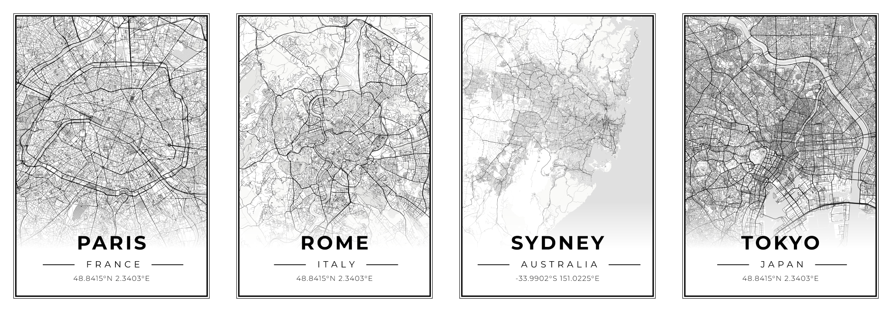

# 🗺️ Map2Poster

[](https://dim4k.github.io/map2poster/)
[](https://github.com/dim4k/map2poster)

> ✨ **Generate stunning high-resolution map posters with customized styling.**
>
> 🔗 **Try it instantly — no install needed:** [**dim4k.github.io/map2poster**](https://dim4k.github.io/map2poster/)



---

## ✨ Features

- **🖼️ Beautiful Map Posters** — Create print-ready city maps for wall art
- **🔍 Search Any Location** — Find cities, addresses, or landmarks instantly
- **🌗 Dark/Light Themes** — Modern glassmorphism UI with seamless theme switching
- **🎛️ Customization Options**:
    - 6 poster styles: **Classic**, **Blueprint**, **Vintage**, **Midnight**, **Swiss**, and **Botanical**
    - **Portrait** & **Landscape** orientations
    - Independent border style selection (mix and match!)
    - Custom colors for borders, text, background, water, roads, parks, and land
    - Custom fonts for city, country, and coordinates
    - Adjustable gradient fade and solid block height
    - Adjustable road width scale and building visibility
    - Adjustable zoom level (10-18)
    - Toggle coordinates and country display
- **📥 High Resolution Export** — Download at 7000×9900px portrait / 9900×7000px landscape (300 DPI, A1 print-ready)
- **📱 Responsive Design** — Fully functional on desktop and mobile devices
- **🔒 Privacy Focused** — No data collection, purely client-side rendering

---

## 🚀 Quick Start

### Online (Recommended)

Just open the app in your browser — nothing to install!

👉 **[dim4k.github.io/map2poster](https://dim4k.github.io/map2poster/)**

### Local

1. **Clone the repository**

    ```sh
    git clone https://github.com/dim4k/map2poster.git
    ```

2. **Open `index.html`** in your browser
    - No build step required! Just open the file directly or serve it with a local server.
    - Recommended: Use VS Code's "Live Server" extension.

3. **Enjoy!**
    - Search for a city
    - Tweak the styles
    - Click **Download Poster**

---

## 🎨 Poster Styles

| Style         | Description                                                          |
| ------------- | -------------------------------------------------------------------- |
| **Classic**   | Timeless design with bold double borders and clean typography.       |
| **Blueprint** | Technical aesthetic with cobalt blue lines and monospaced fonts.     |
| **Vintage**   | Warm sepia tones, retro textures, and classic serif fonts.           |
| **Midnight**  | Dark neon look with cyan accents and illuminated buildings.          |
| **Swiss**     | Minimalist design inspired by Swiss graphic design (bold red roads). |
| **Botanical** | Earthy olive and sage tones with elegant serif typography.           |

---

## 🛠️ Technologies

- **[Vue 3](https://vuejs.org/)** — Reactive UI and Composition API
- **[MapLibre GL JS](https://maplibre.org/)** — Open-source WebGL map rendering
- **[html2canvas](https://html2canvas.hertzen.com/)** — DOM-to-canvas rendering for export
- **[OpenFreeMap](https://openfreemap.org/)** — Free vector map tiles (no API key needed)

---

## 📁 Project Structure

```
map2poster/
├── index.html              Main HTML (Vue template)
├── css/
│   └── styles.css          All styling (poster, UI, responsive)
└── js/
    ├── app.js              Vue app (state, watchers, orchestration)
    ├── poster-config.js    Style defaults, font & border options
    ├── map-styles.js       MapLibre layer styling per poster style
    ├── export.js           High-res PNG export logic + overlay
    └── utils.js            Helpers (debounce, DPI injection, toast...)
```

---

## 📝 Tips

- **Browser Support**: Works best in **Chrome** or **Edge** (Chromium-based browsers) for the most accurate poster rendering.
- **Zoom Level**: For the best detail-to-context ratio, try zoom levels between **12 and 15**.
- **Mobile**: The app is fully responsive! You can design posters on your phone, but downloading on Desktop is recommended for the full resolution file handling.

---

## 📄 License

MIT — Feel free to use and modify for your own projects!

---
